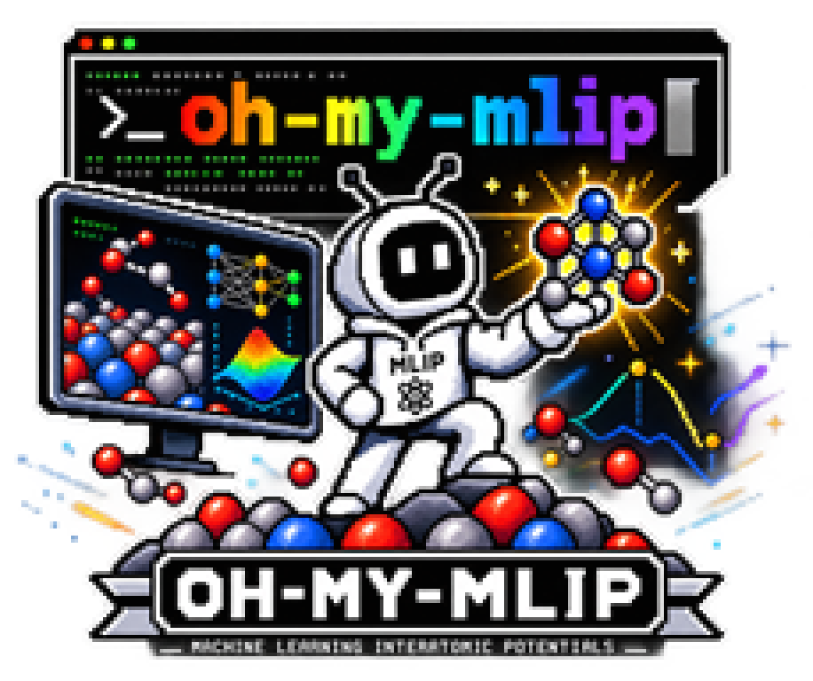

# oh-my-mlip

<p align="center">
  
</p>

[](https://github.com/JinukMoon/oh-my-mlip/actions/workflows/ci.yml)
[](https://jinukmoon.github.io/oh-my-mlip/)
[](LICENSE)

**One registry, many MLIPs.** 20 machine-learning interatomic-potential
frameworks (32 model variants), each in its own conda env built from a pinned
recipe — installed, used, benchmarked, fine-tuned and distilled the same way.
It drives the real upstream frameworks and never reimplements a model.

**Documentation: https://jinukmoon.github.io/oh-my-mlip/**

## Install

```bash
git clone https://github.com/JinukMoon/oh-my-mlip.git && cd oh-my-mlip
source env.sh
./install.sh MACE                                  # MACE in its own conda env
python scripts/setup_verify.py MACE-MPA-0 --json   # energy + forces on your GPU
```

Or let Claude Code do it — add the plugin, then ask "install MACE":

```
/plugin marketplace add JinukMoon/oh-my-mlip
```

```
/plugin install oh-my-mlip@oh-my-mlip
```

Gated models (UMA, eSEN) need a Hugging Face login first — see [Gated models](https://jinukmoon.github.io/oh-my-mlip/gated_models/).

## What it does

| | |
|---|---|
| [**Install**](https://jinukmoon.github.io/oh-my-mlip/howto/install/) | every framework in its own env from a pinned recipe, with exact replay from lock files |
| [**Use a model**](https://jinukmoon.github.io/oh-my-mlip/howto/use-a-model/) | the exact interpreter and calculator lines for your own scripts, or one call across models |
| [**Benchmark**](https://jinukmoon.github.io/oh-my-mlip/howto/catbench/) | CatBench adsorption benchmarks across models, including your own VASP calculations |
| [**Fine-tuning**](https://jinukmoon.github.io/oh-my-mlip/howto/finetune/) | one command drives each framework's own trainer, config and dataset format |
| [**Distillation**](https://jinukmoon.github.io/oh-my-mlip/howto/distill/) | any hub model into an NN-MTP student that runs in LAMMPS |

## Supported MLIPs

<!-- STATUS_TABLE_START -->
| Framework | Models |
|---|---|
| SevenNet | SevenNet-MF-OMPA, SevenNet-Omni |
| MACE | MACE-MPA-0, MACE-MH-1-OMAT, MACE-MH-1-OC20 |
| NequIP | NequIP-OAM-XL, NequIP-OAM-L |
| Allegro | Allegro-OAM-L |
| Nequix | Nequix-MP-1 |
| DeePMD | DPA-3.1-3M-FT |
| ORB | ORB-v3 |
| GRACE | GRACE-2L-OAM |
| MatterSim | MatterSim-v1-5M |
| CHGNet | CHGNet-v0.3.0 |
| AlphaNet | AlphaNet-v1-OMA |
| Eqnorm | Eqnorm-MPtrj |
| fairchemv1 | eSEN-30M-OAM |
| EquiformerV3 | EqV3-OMatMPtrjSalex |
| UMA | UMA-m-1p1-OC20, UMA-m-1p1-OMAT, UMA-s-1p1-OC20, UMA-s-1p1-OMAT, UMA-s-1p2-OC20, UMA-s-1p2-OC22, UMA-s-1p2-OC25, UMA-s-1p2-OMAT |
| PET | PET-OAM-XL |
| EquFlash | EquFlashV2, EquFlash |
| MatRIS | MatRIS-10M-OAM |
| DPA4 | DPA-4.0.1-pro-MPtrj |
| TACE | TACE-OAM-L |
<!-- STATUS_TABLE_END -->

Weights, gating, licenses and upstream repositories: [Supported models](https://jinukmoon.github.io/oh-my-mlip/model_status/).

## License

MIT ([`LICENSE`](LICENSE)). Frameworks and weights keep their upstream licenses; the
distillation engine [`onthefly-distill`](https://github.com/JinukMoon/onthefly-distill)
is a separate GPL-2.0 project.
