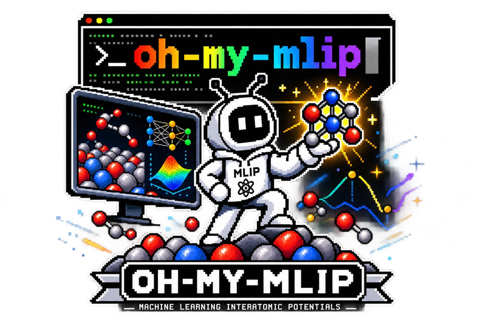

# oh-my-mlip

<p align="center">
  
</p>

**One registry, many MLIPs.** oh-my-mlip covers 20 machine-learning
interatomic-potential frameworks (32 model variants) — MACE, SevenNet, NequIP,
ORB, UMA, … — and lets you:

- **install** any of them, each in its own conda env from a pinned recipe;
- **use** them in your own scripts with the exact interpreter and calculator lines;
- **benchmark** them on adsorption energies with CatBench, including your own VASP calculations;
- **fine-tune** them on your data through each framework's own trainer;
- **distill** any of them into an NN-MTP student that runs in LAMMPS.

It drives the real upstream frameworks and never reimplements a model.

## Get started

```bash
git clone https://github.com/JinukMoon/oh-my-mlip.git && cd oh-my-mlip
source env.sh
./install.sh MACE                                  # MACE's own conda env
python scripts/setup_verify.py MACE-MPA-0 --json   # energy + forces on your GPU
python run_examples/single_point.py MACE           # a first calculation
```

With Claude Code, install the plugin once and ask in plain language
("install MACE", "benchmark my adsorption set"):

```
/plugin marketplace add JinukMoon/oh-my-mlip
/plugin install oh-my-mlip@oh-my-mlip
```

## What you can do

| Task | Guide |
|---|---|
| Install one, several or all models | [Install models](howto/install.md) |
| Use a model in your own script | [Use a model](howto/use-a-model.md) |
| Benchmark adsorption energies | [Benchmark with CatBench](howto/catbench.md) |
| Turn your VASP calculations into a benchmark | [Convert VASP results](howto/vasp-to-catbench.md) |
| Fine-tune a foundation model on your data | [Fine-tuning](howto/finetune.md) |
| Distill any hub model into an NN-MTP student for LAMMPS | [Distillation](howto/distill.md) |

## How it works

- **One env per framework.** Their torch and CUDA stacks conflict, so each
  framework lives in its own conda env; `resolve()` tells you which
  interpreter and which calculator lines belong together.
- **Recipes, not improvisation.** Package sets are pinned in `envs/<env>.yml`,
  and verified builds are recorded as exact lock files in `envs/locks/`.
- **Every procedure is a file.** Job scripts, training commands and reports
  are written to disk before they run, so you can rerun them without an agent.
- **Weights are never hosted here.** They come from each framework's official
  channel; gated models use your own Hugging Face token.
